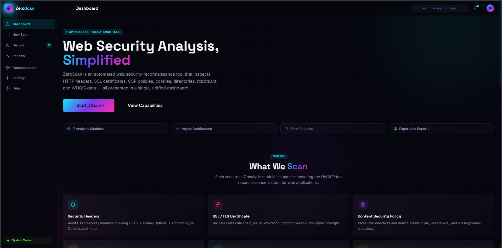
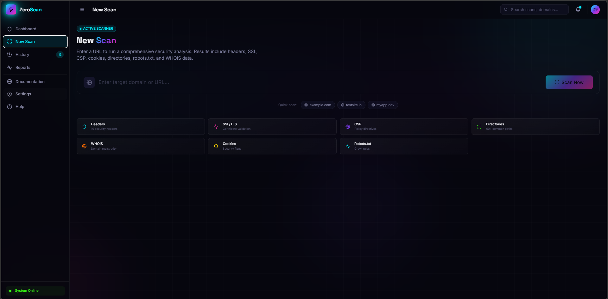
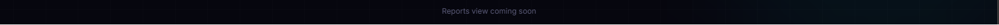

<p align="center">

  
  
  
  
  

</p>

<br/>

<p align="center">
  
</p>

<p align="center">
  <b>Automated web security reconnaissance.</b><br/>
  Seven analysis modules. One dashboard. Zero fluff.
</p>

<p align="center">
  <a href="#features">Features</a> •
  <a href="#modules">Modules</a> •
  <a href="#quick-start">Quick Start</a> •
  <a href="#tech-stack">Tech Stack</a> •
  <a href="#screenshots">Screenshots</a> •
  <a href="#disclaimer">Disclaimer</a>
</p>

<br/>

---

## Why Another Security Scanner?

Because most scanners in 2026 fall into one of two buckets: **enterprise bloatware** that takes 30 minutes to configure, or **CLI toys** that dump raw JSON and call it a day.

ZeroScan sits in the middle. You paste a URL, you get a dashboard. No accounts, no agents, no monthly credit consumption. Seven parallel scanners — headers, SSL, CSP, cookies, robots.txt, directory brute-force, WHOIS — all rendered into a single-page interface that actually tells you what matters.

Built for:
- **Devs** who want to check their own deploy before a pentest
- **Sysadmins** who need a quick posture assessment
- **Researchers** cataloguing security headers across the web
- **Students** learning what "security misconfiguration" actually looks like

---

## Features

```
├── 7 parallel analysis modules
├── Real-time scan progress with module streaming
├── Security score (0-100) with severity breakdown
├── Interactive donut chart (Recharts)
├── Glassmorphism dashboard with cyberpunk theming
├── Framer Motion micro-interactions & transitions
├── Async Python backend (FastAPI + httpx + aiohttp)
├── TypeScript frontend (React + Vite + Tailwind)
└── Full Docker support
```

---

## Modules

| Module | What It Checks | Severity Impact |
|--------|---------------|-----------------|
| **HTTP Headers** | HSTS, X-Frame-Options, X-Content-Type-Options, CSP, Referrer-Policy, Permissions-Policy, CORS, Cache-Control | Missing critical headers = 🔴 score penalty |
| **SSL/TLS** | Certificate validity, issuer, expiry, protocol version (TLS 1.2/1.3), cipher strength | Expired or weak crypto = 🔴 critical |
| **Content Security Policy** | Directive parsing, `unsafe-inline`/`unsafe-eval` detection, missing `frame-ancestors` | Unsafe directives = 🟡 medium |
| **Cookies** | `Secure`, `HttpOnly`, `SameSite` flags on every cookie | Missing flags = 🟠 low |
| **Robots.txt** | File existence, disallowed paths, sensitive directory leakage | Exposed admin paths = 🟠 low |
| **Directory Discovery** | 60+ common paths (`/admin`, `/.git`, `/.env`, `/backup`, `/wp-admin`) | Exposed paths = 🔴 high |
| **WHOIS** | Registrar, creation/expiry dates, name servers, contact emails | Exposed emails = 🟡 medium |

### Scoring System

```
Score = 100 - deductions

  Critical (-15)  →  #FF1744   Red
  High    (-8)    →  #FF6D00   Orange
  Medium  (-4)    →  #FFD700   Yellow
  Low     (-2)    →  #39FF14   Green
  Info    (-0.5)  →  #00F0FF   Cyan
```

Grade mapping: `A+ (≥90)` · `A (≥80)` · `B+ (≥70)` · `B (≥60)` · `C (≥50)` · `D (≥30)` · `F (<30)`

---

## Quick Start

### Prerequisites

- Python 3.12+
- Node.js 20+
- (Optional) Docker

### Backend

```bash
cd backend
python -m venv .venv
source .venv/bin/activate   # Windows: .venv\Scripts\activate
pip install -r requirements.txt
uvicorn app.main:app --reload --port 8000
```

### Frontend

```bash
cd frontend
npm install
npm run dev
```

Open `http://localhost:5173`. The Vite dev server proxies `/api/*` to the backend at `:8000`.

### Docker (both services)

```bash
# Backend
cd backend
docker build -t zeroscanner-api .
docker run -p 8000:8000 zeroscanner-api

# Frontend (separate terminal)
cd frontend
npm run dev
```

---

## Tech Stack

```
Frontend
├── React 18 + TypeScript
├── Tailwind CSS v3 (custom ZeroScan theme tokens)
├── Framer Motion (page transitions, stagger reveals, spring physics)
├── Recharts (donut chart, responsive containers)
├── shadcn/ui-style components (Button, Card, Badge, Progress, Tabs)
├── Lucide React icons
└── Vite 5

Backend
├── FastAPI (async Python web framework)
├── httpx (async HTTP client)
├── aiohttp (alternative async HTTP)
├── python-whois (domain registration lookup)
├── dnspython (DNS resolution)
├── pyOpenSSL (certificate parsing & validation)
├── BeautifulSoup4 + lxml (HTML parsing)
└── Pydantic v2 (request/response validation)
```

---

## Screenshots

> **Dashboard** — Landing page with feature overview, modules grid, and legal disclaimer.
>
> 

> **Scan** — URL input with real-time progress indicators and module status.
>
> 

> **Results Bar** — Security score and summary snapshot.
>
> 

---

## API Endpoints

| Method | Path | Description |
|--------|------|-------------|
| `POST` | `/api/scan` | Execute a full scan. Body: `{ "url": "https://example.com" }` |
| `GET` | `/api/scan/{id}` | Retrieve a scan result by ID |
| `GET` | `/api/history` | List all completed scans |
| `GET` | `/health` | Health check |

### Example

```bash
curl -X POST http://localhost:8000/api/scan \
  -H "Content-Type: application/json" \
  -d '{"url": "https://example.com"}'
```

---

## Project Structure

```
zeroscanner/
├── frontend/
│   ├── src/
│   │   ├── components/
│   │   │   ├── ui/              # Button, Card, Badge, Progress, Tabs
│   │   │   ├── layout/          # Sidebar + Header
│   │   │   ├── scanner/         # Scanner input with animations
│   │   │   └── dashboard/       # Score gauge, charts, analysis cards
│   │   ├── hooks/               # useScanner, useNavigate
│   │   ├── lib/                 # API client, utility functions
│   │   ├── types/               # Full TypeScript type definitions
│   │   ├── pages/               # Dashboard, Scan, History
│   │   └── styles/              # Tailwind globals + custom layers
│   ├── tailwind.config.ts       # ZeroScan design tokens (colors, shadows, keyframes)
│   └── vite.config.ts           # Dev proxy to :8000
│
└── backend/
    ├── app/
    │   ├── api/routes.py        # POST /scan, GET /scan/{id}, GET /history
    │   ├── scanners/            # 7 independent scanner modules
    │   │   ├── headers_scanner.py
    │   │   ├── ssl_scanner.py
    │   │   ├── csp_scanner.py
    │   │   ├── cookies_scanner.py
    │   │   ├── robots_scanner.py
    │   │   ├── directories_scanner.py
    │   │   └── whois_scanner.py
    │   ├── models/schemas.py    # Pydantic request/response models
    │   └── main.py              # FastAPI app, CORS, middleware
    ├── requirements.txt
    └── Dockerfile
```

---

## Contributing

1. Fork it.
2. Create a branch: `git checkout -b feat/your-idea`
3. Commit: `git commit -m "feat: add xyz"`
4. Push: `git push origin feat/your-idea`
5. Open a PR.

Keep it clean. No half-baked patches. Every scanner you add needs async, error handling, and a corresponding frontend card. If you're adding a module, look at `headers_scanner.py` as the reference pattern.

---

## License

MIT — do what you want, just don't blame us.

```
THE SOFTWARE IS PROVIDED "AS IS", WITHOUT WARRANTY OF ANY KIND,
EXPRESS OR IMPLIED, INCLUDING BUT NOT LIMITED TO THE WARRANTIES
OF MERCHANTABILITY, FITNESS FOR A PARTICULAR PURPOSE AND
NONINFRINGEMENT. IN NO EVENT SHALL THE AUTHORS BE LIABLE FOR
ANY CLAIM, DAMAGES OR OTHER LIABILITY, ARISING FROM THE USE OF
THIS SOFTWARE.
```

---

## Disclaimer

<p align="center">
  <b>⚠️ ZeroScan is an educational tool.</b>
</p>

- You may **only** scan systems you own or have explicit written permission to test.
- Unauthorized scanning is illegal in most jurisdictions and may violate computer fraud laws.
- The authors assume **no liability** for misuse of this software.
- By using ZeroScan, you accept full responsibility for your actions.

This tool does **not** exploit vulnerabilities. It identifies **potential** security misconfigurations and exposures. Always verify findings manually and report responsibly through appropriate disclosure channels.

---

<p align="center">
  <sub>Built with late nights and caffeine.<br/>
  Not affiliated with any security vendor. No telemetry, no analytics, no phone-home.</sub>
</p>

<p align="center">
  <sub>⭐ Star if you find this useful — it helps others discover the project.</sub>
</p>

<br/>

<!-- ===== CREDITS BANNER ===== -->
<p align="center">
  <picture>
    <source media="(prefers-color-scheme: dark)" srcset="https://capsule-render.vercel.app/api?type=rect&height=6&color=0:00F0FF,100:7C3AED&text=&fontColor=F0F0F5&reversal=false">
    
  </picture>
</p>

<br/>

<p align="center">
  <a href="#">
    
  </a>
</p>

<p align="center">
  <a href="#">
    
  </a>
</p>

<br/>

## 👨‍💻 Credits

<p align="center">
  
</p>

<h3 align="center">Made by Mr L</h3>

<p align="center"><b>Full-Stack Security Engineer</b></p>

<p align="center">
UI/UX • Frontend • Backend • Infrastructure
</p>

<p align="center">
  <a href="#">
    
    
  </a>
</p>

<br/>

<p align="center">
  <picture>
    <source media="(prefers-color-scheme: dark)" srcset="https://capsule-render.vercel.app/api?type=rect&height=6&color=0:7C3AED,100:00F0FF&text=&fontColor=F0F0F5&reversal=true">
    
  </picture>
</p>
